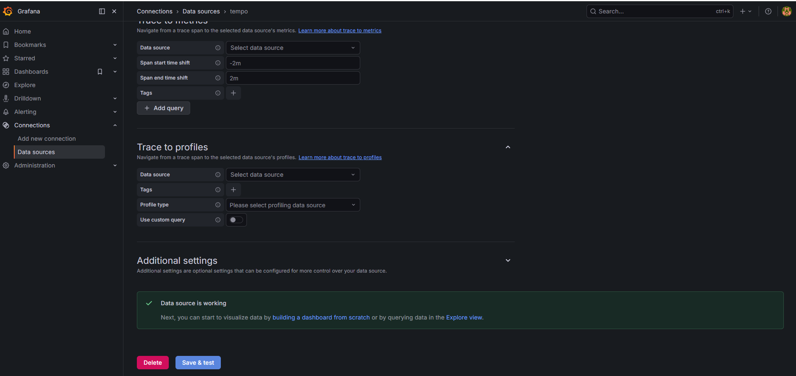
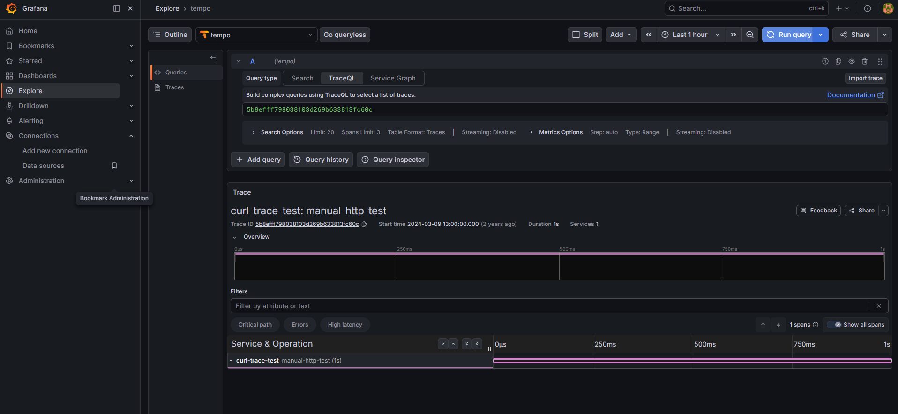

# Kubernetes Tracing Stack

Implementação de Distributed Tracing em Kubernetes utilizando OpenTelemetry Collector, Grafana Tempo e Grafana.

Este projeto demonstra a coleta, processamento, armazenamento e visualização de traces distribuídos em um ambiente Kubernetes, seguindo boas práticas de observabilidade moderna.

---

## Arquitetura

```text
Application
      │
      ▼
OpenTelemetry Collector
      │
      ▼
Grafana Tempo
      │
      ▼
Grafana
```

---

## Tecnologias Utilizadas

- Kubernetes
- Helm
- OpenTelemetry Collector
- Grafana Tempo
- Grafana
- OTLP (gRPC/HTTP)

---

## Estrutura do Projeto

```text
k8s-tracing-stack/
├── tracing/
│   ├── install.sh
│   └── otel-values.yaml
├── screenshots/
│   ├── tempo-datasource.png
│   └── tempo-trace.png
└── README.md
```

---

## Componentes

### Grafana Tempo

Responsável pelo armazenamento e consulta de traces distribuídos.

### OpenTelemetry Collector

Recebe traces através dos protocolos OTLP e exporta os dados para o Tempo.

### Grafana

Utilizado para consulta e visualização dos traces.

---

## Instalação

### Adicionar repositórios Helm

```bash
helm repo add grafana https://grafana.github.io/helm-charts
helm repo add open-telemetry https://open-telemetry.github.io/opentelemetry-helm-charts

helm repo update
```

### Instalar Grafana Tempo

```bash
helm upgrade --install tempo grafana/tempo \
  -n tracing \
  --create-namespace
```

### Instalar OpenTelemetry Collector

```bash
helm upgrade --install otel-collector \
  open-telemetry/opentelemetry-collector \
  -n tracing \
  -f tracing/otel-values.yaml
```

---

## Configuração do Grafana

Adicionar um novo Data Source:

### Tipo

```text
Tempo
```

### URL

```text
http://tempo.tracing.svc.cluster.local:3200
```

Após salvar:

```text
Data source is working
```

---

## OpenTelemetry Collector

Receivers configurados:

```yaml
receivers:
  otlp:
    protocols:
      grpc:
      http:
```

Processor:

```yaml
processors:
  batch: {}
```

Exporter:

```yaml
exporters:
  otlp:
    endpoint: tempo.tracing.svc.cluster.local:4317
    tls:
      insecure: true
```

Pipeline:

```yaml
service:
  pipelines:
    traces:
      receivers:
        - otlp
      processors:
        - batch
      exporters:
        - otlp
```

---

## Validação

Verificar pods:

```bash
kubectl get pods -n tracing
```

Resultado esperado:

```text
tempo-0                                   Running
otel-collector-opentelemetry-collector    Running
```

Verificar serviços:

```bash
kubectl get svc -n tracing
```

---

## Teste de Tracing

Executar um pod temporário:

```bash
kubectl run trace-test \
  --image=curlimages/curl \
  -it --rm \
  --restart=Never -- sh
```

Enviar trace OTLP HTTP:

```bash
curl -X POST \
http://otel-collector-opentelemetry-collector.tracing.svc.cluster.local:4318/v1/traces \
-H "Content-Type: application/json" \
-d '<payload>'
```

Consultar no Grafana:

```text
Explore
→ Tempo
→ Search Trace ID
```

---

## Screenshots

### Tempo Data Source



### Distributed Trace



---

## Resultados

Implementação validada com:

- Recebimento de traces via OTLP HTTP
- Processamento pelo OpenTelemetry Collector
- Armazenamento no Grafana Tempo
- Consulta de traces no Grafana
- Visualização da timeline e spans

---

## Conceitos Demonstrados

- Distributed Tracing
- OpenTelemetry
- OTLP
- Observabilidade
- Kubernetes
- Helm
- Grafana Tempo
- Grafana

---

## Próximos Passos

- Service Graphs
- OpenTelemetry Auto Instrumentation
- Loki Integration
- Prometheus Integration
- Amazon EKS
- Full Observability Stack

---

## Autor

Paulo Júnior

GitHub:
https://github.com/pauloojr

LinkedIn:
https://www.linkedin.com/in/paulojúnior